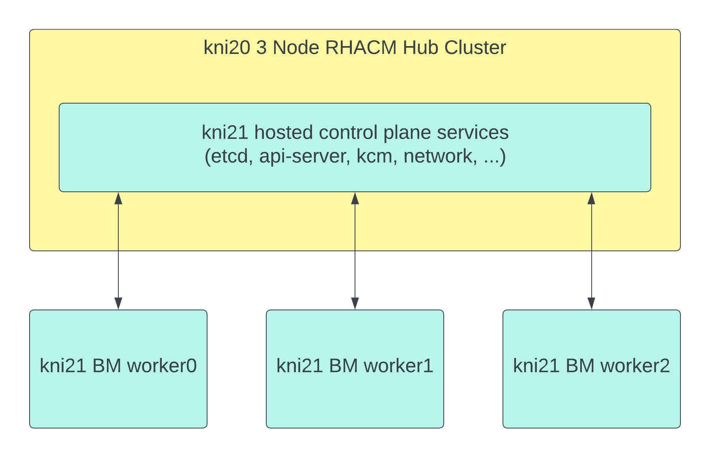

# **Workloads on Bare Metal Hosted Clusters**

In a previous blog on [How to Build Bare Metal Hosted Clusters on Red Hat Advanced Cluster Management for Kubernetes](https://cloud.redhat.com/blog/how-to-build-bare-metal-hosted-clusters-on-red-hat-advanced-cluster-management-for-kubernetes) I discussed how one could deploy a hosted cluster.  The blog outlined the benefits of running hosted clusters which included minimal time to deploy and cost savings due to the control plane running on an existing OpenShift cluster.  I further demonstrated how to build out the environment and validate that the installation was completed sucessfully.  Today however I want to move onto the day two activities like running workloads on that hosted cluster which is exactly what we will cover in this blog.   

## Lab Environment

First lets review the lab environment so we are familiar with how the hosted cluster was deployed.  Looking back we originally had a 3 node compact  Red Hat Advanced Cluster Management for Kubernetes 2.6 hub cluster running on OpenShift 4.10.26 called kni20.  This hub cluster has since been upgraded to OpenShift 4.11.3.  We used the hub cluster to deploy a hosted cluster running OpenShift 4.11.2 called kni21 where the control plane is running as containers on our hub cluster and then we also have 3 bare metal worker nodes for our workloads.  The high level architecture looks like the image below:

The kni21 worker nodes contain a second disk which we will make use of for our workloads from a storage perspective.  Further our DNS records for our kni21 environment look like the following since we were using the nodeport method for exposing our api and ingress routes:

~~~bash
Name:	api.kni21.schmaustech.com
Address: 192.168.0.211

Name:	*.apps.kni21.schmaustech.com
Address: 192.168.0.116
Name:	*.apps.kni21.schmaustech.com
Address: 192.168.0.118
Name:	*.apps.kni21.schmaustech.com
Address: 192.168.0.117
~~~

Now that we have an idea of how the environment is setup lets turn our attention to running workloads.

## The Workloads

When it comes to deploying workloads on a hosted cluster it really should not be any different then when deploying on a standard OpenShift cluster.   The same methods whether using cli or UI apply in installing and configuring various operators and applications.  In our case today we will be deploying OpenShift Data Foundation and OpenShift Containerized virtualization in the hosted cluster environment.  But first we need to get access and validate our hosted cluster is ready to have additional workloads added.

First lets validate the hosted cluster is ready to accept workloads.  We can first check the status of the hosted cluster object:

~~~bash
$ oc get hostedcluster -n kni21
NAME    VERSION   KUBECONFIG               PROGRESS    AVAILABLE   PROGRESSING   MESSAGE
kni21   4.11.2    kni21-admin-kubeconfig   Completed   True        False         The hosted control plane is available
~~~

We can also validate the nodepool to confirm the desired worker node count is present:

~~~bash
$ oc get nodepool -n kni21
NAME               CLUSTER   DESIRED NODES   CURRENT NODES   AUTOSCALING   AUTOREPAIR   VERSION   UPDATINGVERSION   UPDATINGCONFIG   MESSAGE
nodepool-kni21-1   kni21     3               3               False         False        4.11.2  
~~~

And finally we can now extract the kubeconfig for the kni21 cluster so we can run commands against the hosted cluster:

~~~bash
$ oc extract -n kni21 secret/kni21-admin-kubeconfig --to=- > kubeconfig-kni21
# kubeconfig
~~~

Now lets go ahead and set our KUBECONFIG variable to the kubeconfig we extracted and view the nodes:

~~~bash
$ export KUBECONFIG=/home/bschmaus/kubeconfig-kni21
$ oc get nodes
NAME                            STATUS   ROLES    AGE   VERSION
asus3-vm1.kni.schmaustech.com   Ready    worker   75m   v1.24.0+b62823b
asus3-vm2.kni.schmaustech.com   Ready    worker   75m   v1.24.0+b62823b
asus3-vm3.kni.schmaustech.com   Ready    worker   74m   v1.24.0+b62823b
~~~

We can see from the above output that all our worker nodes for the hosted cluster kni21 are in a ready state.   I should point out here that we do not see any control plane nodes listed and this is because there are no control plane nodes only control plane service pods which reside on our hub cluster.

Let's move onto installing and configuring OpenShift Data Foundation.

## Deploying OpenShift Data Foundation

Now that we know our hosted cluster is ready to consume workloads lets get started by installing OpenShift Data Foundation.  I already know that in each of my worker nodes I have a secondary 120GB block device called sdb so I will skip using oc debug to check for the block devices.   Next I will go ahead and label my worker nodes for storage:

~~~bash
$ oc label nodes asus3-vm1.kni.schmaustech.com cluster.ocs.openshift.io/openshift-storage=''
node/asus3-vm1.kni.schmaustech.com labeled
$ oc label nodes asus3-vm2.kni.schmaustech.com cluster.ocs.openshift.io/openshift-storage=''
node/asus3-vm2.kni.schmaustech.com labeled
$ oc label nodes asus3-vm3.kni.schmaustech.com cluster.ocs.openshift.io/openshift-storage=''
node/asus3-vm3.kni.schmaustech.com labeled
~~~

Now let's confirm the label changes before we proceed:

~~~bash
$ oc get nodes -l cluster.ocs.openshift.io/openshift-storage=
NAME                            STATUS   ROLES    AGE   VERSION
asus3-vm1.kni.schmaustech.com   Ready    worker   83m   v1.24.0+b62823b
asus3-vm2.kni.schmaustech.com   Ready    worker   83m   v1.24.0+b62823b
asus3-vm3.kni.schmaustech.com   Ready    worker   82m   v1.24.0+b62823b
~~~

Now we can proceed by installing the Local Storage Operator 4.11 which will be used by OpenShift Data Foundation 4.11.  The first thing we need to do is create the namespace of it by creating the custom resource yaml and then applying it to the hosted cluster:

~~~bash
cat << EOF > ~/openshift-local-storage-namespace.yaml
apiVersion: v1
kind: Namespace
metadata:
  name: openshift-local-storage
spec: {}
EOF

$ oc create -f ~/openshift-local-storage-namespace.yaml
namespace/openshift-local-storage created
~~~

Next we can create the storage group customer resource yaml and then apply that as well to the hosted cluster:

~~~bash
cat << EOF > ~/openshift-local-storage-group.yaml
apiVersion: operators.coreos.com/v1
kind: OperatorGroup
metadata:
  name: local-operator-group
  namespace: openshift-local-storage
spec:
  targetNamespaces:
  - openshift-local-storage
EOF

oc create -f ~/openshift-local-storage-group.yaml
operatorgroup.operators.coreos.com/local-operator-group created
~~~

Now we can proceed to create a subscription for the Local Storage Operator and apply that to the hosted cluster:

~~~bash
cat << EOF > ~/openshift-local-storage-subscription.yaml
apiVersion: operators.coreos.com/v1alpha1
kind: Subscription
metadata:
  name: local-storage-operator
  namespace: openshift-local-storage
spec:
  channel: "4.11"
  installPlanApproval: Automatic
  name: local-storage-operator
  source: redhat-operators
  sourceNamespace: openshift-marketplace
EOF

$ oc create -f openshift-local-storage-subscription.yaml
subscription.operators.coreos.com/local-storage-operator created
~~~

After a few minutes we should be able to see the operator running:

~~~bash

~~~
~~~
