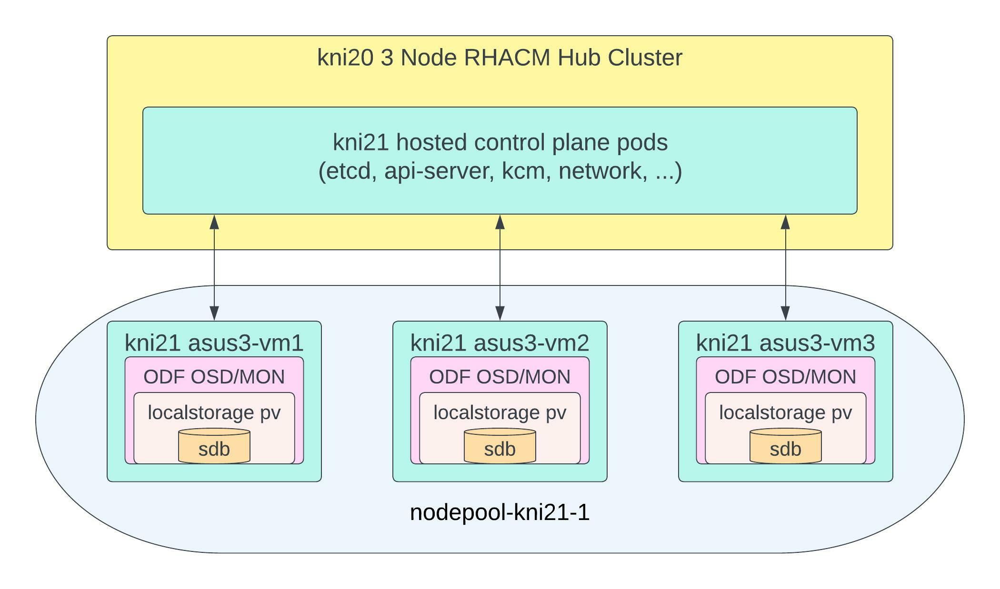

# **Workloads on Bare Metal Hosted Clusters Deployed From Red Hat Advanced Cluster Management for Kubernetes**

In a previous blog on [How to Build Bare Metal Hosted Clusters on Red Hat Advanced Cluster Management for Kubernetes](https://cloud.redhat.com/blog/how-to-build-bare-metal-hosted-clusters-on-red-hat-advanced-cluster-management-for-kubernetes) I discussed how one could deploy a hosted cluster.  The blog outlined the benefits of running hosted clusters which included minimal time to deploy and cost savings due to the control plane running on an existing OpenShift cluster.  I further demonstrated how to build out the environment and validate that the installation was completed sucessfully.  Today however I want to move onto the day two activities like running workloads on that hosted cluster which is exactly what we will cover in this blog.   

## Lab Environment

First lets review the lab environment so we are familiar with how the hosted cluster was deployed.  Looking back we originally had a 3 node compact  Red Hat Advanced Cluster Management for Kubernetes 2.6 hub cluster running on OpenShift 4.10.26 called kni20.  This hub cluster has since been upgraded to OpenShift 4.11.3.  We used the hub cluster to deploy a hosted cluster running OpenShift 4.11.2 called kni21 where the control plane is running as containers on our hub cluster and then we also have 3 bare metal worker nodes for our workloads.  The high level architecture looks like the image below:

The kni21 worker nodes contain a second disk which we will make use of for our workloads from a storage perspective.  Further our DNS records for our kni21 environment look like the following since we were using the nodeport method for exposing our api and ingress routes:

~~~bash
Name:	api.kni21.schmaustech.com
Address: 192.168.0.211

Name:	*.apps.kni21.schmaustech.com
Address: 192.168.0.116
Name:	*.apps.kni21.schmaustech.com
Address: 192.168.0.118
Name:	*.apps.kni21.schmaustech.com
Address: 192.168.0.117
~~~

Now that we have an idea of how the environment is setup lets turn our attention to running workloads.

## The Workloads

When it comes to deploying workloads on a hosted cluster it really should not be any different then when deploying on a standard baremetal OpenShift cluster.   The same methods whether using cli or UI apply in installing and configuring various operators and applications.  Those operators and applications will get scheduled on any schedulable worker node in the cluster.  For the purpose of this blog I will be deploying the following workloads and supporting operators:

 * Local Storage Operator
 * OpenShift Data Foundation
 * OpenShift Containerized Virtualization
 * Launching a virtual machine

Before we begin however we should get access and validate our hosted cluster is ready to accept the workloads defined above.

First lets validate the hosted cluster is ready and online.  We can first check the status of the hosted cluster object.

~~~bash
$ oc get hostedcluster -n kni21
NAME    VERSION   KUBECONFIG               PROGRESS    AVAILABLE   PROGRESSING   MESSAGE
kni21   4.11.2    kni21-admin-kubeconfig   Completed   True        False         The hosted control plane is available
~~~

We can also validate the nodepool to confirm the desired worker node count is present:

~~~bash
$ oc get nodepool -n kni21
NAME               CLUSTER   DESIRED NODES   CURRENT NODES   AUTOSCALING   AUTOREPAIR   VERSION   UPDATINGVERSION   UPDATINGCONFIG   MESSAGE
nodepool-kni21-1   kni21     3               3               False         False        4.11.2  
~~~

And finally we can now extract the kubeconfig for the kni21 cluster so we can run commands against the hosted cluster.

~~~bash
$ oc extract -n kni21 secret/kni21-admin-kubeconfig --to=- > kubeconfig-kni21
# kubeconfig
~~~

Now lets go ahead and set our KUBECONFIG variable to the kubeconfig we extracted and view the nodes.

~~~bash
$ export KUBECONFIG=/home/bschmaus/kubeconfig-kni21
$ oc get nodes
NAME                            STATUS   ROLES    AGE   VERSION
asus3-vm1.kni.schmaustech.com   Ready    worker   75m   v1.24.0+b62823b
asus3-vm2.kni.schmaustech.com   Ready    worker   75m   v1.24.0+b62823b
asus3-vm3.kni.schmaustech.com   Ready    worker   74m   v1.24.0+b62823b
~~~

We can see from the above output that all our worker nodes for the hosted cluster kni21 are in a ready state.   I should point out here that we do not see any control plane nodes listed and this is because there are no control plane nodes only control plane service pods which reside on our hub cluster.

Let's move onto installing and configuring our workloads.

## Deploying Local Storage Operator

Now that we know our hosted cluster is ready to consume workloads lets get started by installing the Local Storage Operator.  When we are finished we should have the results similar to what is in the following diagram in that a local storage PV will be created for every sdb block device.

I already know that in each of my worker nodes I have a secondary 120GB block device called sdb so I will skip using oc debug to check for the block devices.   Next I will go ahead and label my worker nodes for storage.

~~~bash
$ oc label nodes asus3-vm1.kni.schmaustech.com cluster.ocs.openshift.io/openshift-storage=''
node/asus3-vm1.kni.schmaustech.com labeled
$ oc label nodes asus3-vm2.kni.schmaustech.com cluster.ocs.openshift.io/openshift-storage=''
node/asus3-vm2.kni.schmaustech.com labeled
$ oc label nodes asus3-vm3.kni.schmaustech.com cluster.ocs.openshift.io/openshift-storage=''
node/asus3-vm3.kni.schmaustech.com labeled
~~~

Now let's confirm the label changes before we proceed:

~~~bash
$ oc get nodes -l cluster.ocs.openshift.io/openshift-storage=
NAME                            STATUS   ROLES    AGE   VERSION
asus3-vm1.kni.schmaustech.com   Ready    worker   83m   v1.24.0+b62823b
asus3-vm2.kni.schmaustech.com   Ready    worker   83m   v1.24.0+b62823b
asus3-vm3.kni.schmaustech.com   Ready    worker   82m   v1.24.0+b62823b
~~~

Now we can proceed by installing the Local Storage Operator which will be used by OpenShift Data Foundation.  The first thing we need to do is create the namespace of it by creating the custom resource yaml and then applying it to the hosted cluster.

~~~bash
cat << EOF > ~/openshift-local-storage-namespace.yaml
apiVersion: v1
kind: Namespace
metadata:
  name: openshift-local-storage
spec: {}
EOF

$ oc create -f ~/openshift-local-storage-namespace.yaml
namespace/openshift-local-storage created
~~~

Next we can create the storage group customer resource yaml and then apply that as well to the hosted cluster.

~~~bash
cat << EOF > ~/openshift-local-storage-group.yaml
apiVersion: operators.coreos.com/v1
kind: OperatorGroup
metadata:
  name: local-operator-group
  namespace: openshift-local-storage
spec:
  targetNamespaces:
  - openshift-local-storage
EOF

oc create -f ~/openshift-local-storage-group.yaml
operatorgroup.operators.coreos.com/local-operator-group created
~~~

Now we can proceed to create a subscription for the Local Storage Operator and apply that to the hosted cluster.

~~~bash
$ cat << EOF > ~/openshift-local-storage-subscription.yaml
apiVersion: operators.coreos.com/v1alpha1
kind: Subscription
metadata:
  name: local-storage-operator
  namespace: openshift-local-storage
spec:
  channel: "stable"
  installPlanApproval: Automatic
  name: local-storage-operator
  source: redhat-operators
  sourceNamespace: openshift-marketplace
EOF

$ oc create -f ~/openshift-local-storage-subscription.yaml
subscription.operators.coreos.com/local-storage-operator created
~~~

After a few minutes we should be able to see the operator running.

~~~bash
$ oc get pods -n openshift-local-storage
NAME                                      READY   STATUS    RESTARTS   AGE
local-storage-operator-864768c8cb-slgc2   1/1     Running   0          60s
~~~

Now that we have the local storage operator installed lets make a LocalVolume storage definition file that will use the disk device in each node. We can  see that this is set to create a local volume on every host from the block device sdb where the selector key matches cluster.ocs.openshift.io/openshift-storage. If we had additional devices on the worker nodes for example: sdd and sde, we would just list those below the devicePaths to also be incorporated into our configuration.

~~~bash
$ cat << EOF > ~/local-storage.yaml
apiVersion: local.storage.openshift.io/v1
kind: LocalVolume
metadata:
  name: local-block
  namespace: openshift-local-storage
spec:
  nodeSelector:
    nodeSelectorTerms:
    - matchExpressions:
        - key: cluster.ocs.openshift.io/openshift-storage
          operator: In
          values:
          - ""
  storageClassDevices:
    - storageClassName: localblock
      volumeMode: Block
      devicePaths:
        - /dev/sdb
EOF
~~~

Now we can go ahead and create the assets for this local-storage configuration using the local-storage.yaml we created above.

~~~bash
$ oc create -f ~/local-storage.yaml
localvolume.local.storage.openshift.io/local-block created
~~~

After a few minutes we should see a diskmaker manager pod running on each worker node in our hosted cluster.

~~~bash
$ oc -n openshift-local-storage get pods -o wide
NAME                                      READY   STATUS    RESTARTS   AGE   IP            NODE                            NOMINATED NODE   READINESS GATES
diskmaker-manager-lmzs8                   2/2     Running   0          32m   10.134.0.19   asus3-vm1.kni.schmaustech.com   <none>           <none>
diskmaker-manager-qmw5t                   2/2     Running   0          32m   10.133.0.20   asus3-vm3.kni.schmaustech.com   <none>           <none>
diskmaker-manager-x8qgz                   2/2     Running   0          32m   10.132.0.32   asus3-vm2.kni.schmaustech.com   <none>           <none>
local-storage-operator-864768c8cb-slgc2   1/1     Running   0          36m   10.133.0.19   asus3-vm3.kni.schmaustech.com   <none>           <none>
~~~

We can also see that three PVs were also created one for each worker node reflecting the use of the sdb device on each worker node in the hosted cluster.

~~~bash
$ oc get pv -o wide
NAME                CAPACITY   ACCESS MODES   RECLAIM POLICY   STATUS      CLAIM   STORAGECLASS   REASON   AGE   VOLUMEMODE
local-pv-3055d2e7   120Gi      RWO            Delete           Available           localblock              20m   Block
local-pv-978f0e97   120Gi      RWO            Delete           Available           localblock              20m   Block
local-pv-ceca062c   120Gi      RWO            Delete           Available           localblock              20m   Block
~~~

And finally a storageclass was created for the local-storage asset we created.

~~~bash
$ oc get sc
NAME         PROVISIONER                    RECLAIMPOLICY   VOLUMEBINDINGMODE      ALLOWVOLUMEEXPANSION   AGE
localblock   kubernetes.io/no-provisioner   Delete          WaitForFirstConsumer   false                  22m
~~~

We have now completed installing and configuring the Local Storage Operator.   We can now move onto our next layer of our workload stack.

## Deploying OpenShift Data Foundation

At this point we have now completed the prerequisites of installing the Local Storage Operator. We can now turn our attention to installing OpenShift Data Foundation which will consume those local storage PVs and leverage them in a storage cluster which will provide block, object and file.  The following diagram depicts a high level overview of where those storage cluster components reside.

To get started with the installation we need to go ahead and create the openshift-storage namespace.

~~~bash
$ cat << EOF > ~/openshift-storage-namespace.yaml
apiVersion: v1
kind: Namespace
metadata:
  labels:
    openshift.io/cluster-monitoring: "true"
  name: openshift-storage
spec: {}
EOF
~~~~

Next we will create the namespace from the customer resource yaml we created above.

~~~bash
$ oc create -f ~/openshift-storage-namespace.yaml
namespace/openshift-storage created
~~~

With the namespace created we need to create and operator group and a subscription just like we did with the local storage operator.  However this time we will create both from the same resource yaml file.

~~~bash
$ cat << EOF > ~/openshift-storage-subscription.yaml
---
apiVersion: operators.coreos.com/v1
kind: OperatorGroup
metadata:
  name: openshift-storage-operatorgroup
  namespace: openshift-storage
spec:
  targetNamespaces:
  - openshift-storage
---
apiVersion: operators.coreos.com/v1alpha1
kind: Subscription
metadata:
  name: ocs-operator
  namespace: openshift-storage
spec:
  channel: "stable-4.11"
  installPlanApproval: Automatic
  name: odf-operator
  source: redhat-operators
  sourceNamespace: openshift-marketplace
EOF
~~~

Lets go ahead and create the operator group and subscription from the resource yaml file we created:

~~~bash
$ oc create -f ~/openshift-storage-subscription.yaml
operatorgroup.operators.coreos.com/openshift-storage-operatorgroup created
subscription.operators.coreos.com/ocs-operator created
~~~

With the namespace, openshift-storage operator group and subscription created we should in a few minutes have the required running pods for the OpenShift Data Foundation Operator in the environment.

~~~bash
$ oc get pods -n openshift-storage
NAME                                               READY   STATUS    RESTARTS   AGE
csi-addons-controller-manager-db678484c-h8lc6      2/2     Running   0          2m45s
noobaa-operator-67d4d55688-ztnf7                   1/1     Running   0          3m5s
ocs-metrics-exporter-977854c58-4pjxb               1/1     Running   0          84s
ocs-operator-678d6b5d89-6k8mj                      1/1     Running   0          2m51s
odf-console-54f74bc899-2gtb6                       1/1     Running   0          3m2s
odf-operator-controller-manager-65d8c775c4-k4w6h   2/2     Running   0          3m2s
rook-ceph-operator-7b55877858-x5q77                1/1     Running   0          2m50s
~~~

Now that we know the operator is deployed (and the associated pods are running) we can proceed to creating a hyperconverged OpenShift Data Foundation cluster.  To do this we first need to create a storage cluster yaml file that will allow us to consume each of the pvs per worker node that we configured via the Local Storage Operator.  We will also configure cpu, memory, replicas and which components the operator will manage in this file.

~~~bash
$ cat << EOF > ~/openshift-storage-cluster.yaml
apiVersion: ocs.openshift.io/v1
kind: StorageCluster
metadata:
  name: ocs-storagecluster
  namespace: openshift-storage
spec:
  manageNodes: false
  resources:
    mds:
      limits:
        cpu: "3"
        memory: "6Gi"
      requests:
        cpu: "3"
        memory: "6Gi"
  monDataDirHostPath: /var/lib/rook
  managedResources:
    cephBlockPools:
      reconcileStrategy: manage
    cephFilesystems:
      reconcileStrategy: manage
    cephObjectStoreUsers:
      reconcileStrategy: manage
    cephObjectStores:
      reconcileStrategy: manage
    snapshotClasses:
      reconcileStrategy: manage
    storageClasses:
      reconcileStrategy: manage
  multiCloudGateway:
    reconcileStrategy: manage
  storageDeviceSets:
  - count: 1
    dataPVCTemplate:
      spec:
        accessModes:
        - ReadWriteOnce
        resources:
          requests:
            storage: "120Gi"
        storageClassName: localblock
        volumeMode: Block
    name: ocs-deviceset
    placement: {}
    portable: false
    replica: 3
    resources:
      limits:
        cpu: "2"
        memory: "5Gi"
      requests:
        cpu: "2"
        memory: "5Gi"
EOF
~~~

If we look at the above storage cluster yaml the key things that stand out are the count, the storage size, storageclass and replica.  Because we have 2 pvs on each worker that we want included in our storage cluster from the local storage storage class we set the replica to 3 and the count to 2.   We also specify that we want to use 100Gi pvs from the localblock storage class.  We can also note the resource limits on CPU and memory to ensure that the storage cluster does not use all the resources on the worker nodes.

With the storage cluster yaml created lets go ahead and create the storage cluster:

~~~bash
$ oc create -f ~/openshift-storage-cluster.yaml
storagecluster.ocs.openshift.io/ocs-storagecluster created
~~~

If we run an oc get pods for the openshift-storage namespace we can see pods are starting to create to build out the storage cluster.  If one wanted to watch this continuously we could throw a watch command in front of the oc command.   It will take a few minutes to instantiate the cluster nevertheless.

Finally after about 5 minutes we can see all the pods that have been generated to deploy the OCS storage cluster:

~~~bash
$ oc get pods -n openshift-storage
NAME                                                              READY   STATUS      RESTARTS      AGE
csi-addons-controller-manager-db678484c-h8lc6                     2/2     Running     2 (14m ago)   29m
csi-cephfsplugin-mgf92                                            3/3     Running     0             7m41s
csi-cephfsplugin-provisioner-7bdf9d685c-l28x5                     6/6     Running     0             7m41s
csi-cephfsplugin-provisioner-7bdf9d685c-tqdvw                     6/6     Running     0             7m42s
csi-cephfsplugin-w26pp                                            3/3     Running     0             7m41s
csi-cephfsplugin-zgrph                                            3/3     Running     0             7m42s
csi-rbdplugin-provisioner-cc79dfc7b-rfhw4                         7/7     Running     0             7m42s
csi-rbdplugin-provisioner-cc79dfc7b-zn7fb                         7/7     Running     0             7m43s
csi-rbdplugin-qkfbv                                               4/4     Running     0             7m43s
csi-rbdplugin-txxr5                                               4/4     Running     0             7m43s
csi-rbdplugin-xktrt                                               4/4     Running     0             7m43s
noobaa-core-0                                                     1/1     Running     0             82s
noobaa-db-pg-0                                                    1/1     Running     0             85s
noobaa-operator-67d4d55688-ztnf7                                  1/1     Running     1 (80s ago)   29m
ocs-metrics-exporter-977854c58-4pjxb                              1/1     Running     0             27m
ocs-operator-678d6b5d89-6k8mj                                     1/1     Running     2 (14m ago)   29m
odf-console-54f74bc899-2gtb6                                      1/1     Running     0             29m
odf-operator-controller-manager-65d8c775c4-k4w6h                  2/2     Running     1 (14m ago)   29m
rook-ceph-crashcollector-asus3-vm1.kni.schmaustech.com-6776zjlw   1/1     Running     0             2m6s
rook-ceph-crashcollector-asus3-vm2.kni.schmaustech.com-7cc4pn4b   1/1     Running     0             2m10s
rook-ceph-crashcollector-asus3-vm3.kni.schmaustech.com-784jxfwt   1/1     Running     0             3m13s
rook-ceph-mds-ocs-storagecluster-cephfilesystem-a-757db8fb5vh4v   2/2     Running     0             2m12s
rook-ceph-mds-ocs-storagecluster-cephfilesystem-b-97cf869-mfj7f   2/2     Running     0             2m9s
rook-ceph-mgr-a-698c899c69-8dmxh                                  2/2     Running     0             3m32s
rook-ceph-mon-a-5895f8556b-2d2w6                                  2/2     Running     0             4m45s
rook-ceph-mon-b-676cdcb5bf-5b26q                                  2/2     Running     0             4m14s
rook-ceph-mon-c-6b66d85467-t2wjp                                  2/2     Running     0             3m53s
rook-ceph-operator-7b55877858-x5q77                               1/1     Running     0             29m
rook-ceph-osd-0-76d7855dbb-r9q9f                                  2/2     Running     0             2m39s
rook-ceph-osd-1-7f5db57655-xwgkn                                  2/2     Running     0             2m36s
rook-ceph-osd-2-7cf6f8bc64-h58gz                                  2/2     Running     0             2m35s
rook-ceph-osd-prepare-ocs-deviceset-0-data-06j5df-z75jf           0/1     Completed   0             2m57s
rook-ceph-osd-prepare-ocs-deviceset-1-data-0gf9tv-v8f2t           0/1     Completed   0             2m55s
rook-ceph-osd-prepare-ocs-deviceset-2-data-0vbtdz-5kxb8           0/1     Completed   0             2m54s
rook-ceph-rgw-ocs-storagecluster-cephobjectstore-a-79bcfc7xgfst   2/2     Running     0             2m2s
~~~

We can also confirm this from the command line by issuing an oc get storageclass.  We should see 4 new storageclasses: one for block (rbd), two for object (rgw/nooba) and one for file(cephfs).  

~~~bash
$ oc get storageclass
NAME                          PROVISIONER                             RECLAIMPOLICY   VOLUMEBINDINGMODE      ALLOWVOLUMEEXPANSION   AGE
localblock                    kubernetes.io/no-provisioner            Delete          WaitForFirstConsumer   false                  15h
ocs-storagecluster-ceph-rbd   openshift-storage.rbd.csi.ceph.com      Delete          Immediate              true                   95m
ocs-storagecluster-ceph-rgw   openshift-storage.ceph.rook.io/bucket   Delete          Immediate              false                  101m
ocs-storagecluster-cephfs     openshift-storage.cephfs.csi.ceph.com   Delete          Immediate              true                   95m
openshift-storage.noobaa.io   openshift-storage.noobaa.io/obc         Delete          Immediate              false                  92m
~~~

Before we move on lets go ahead and set the rbd storageclass to the default.

~~~bash
$ oc patch storageclass  ocs-storagecluster-ceph-rbd -p '{"metadata": {"annotations":{"storageclass.kubernetes.io/is-default-class":"true"}}}'
storageclass.storage.k8s.io/ocs-storagecluster-ceph-rbd patched

$ oc get sc
NAME                                    PROVISIONER                             RECLAIMPOLICY   VOLUMEBINDINGMODE      ALLOWVOLUMEEXPANSION   AGE
localblock                              kubernetes.io/no-provisioner            Delete          WaitForFirstConsumer   false                  15h
ocs-storagecluster-ceph-rbd (default)   openshift-storage.rbd.csi.ceph.com      Delete          Immediate              true                   97m
ocs-storagecluster-ceph-rgw             openshift-storage.ceph.rook.io/bucket   Delete          Immediate              false                  103m
ocs-storagecluster-cephfs               openshift-storage.cephfs.csi.ceph.com   Delete          Immediate              true                   97m
openshift-storage.noobaa.io             openshift-storage.noobaa.io/obc         Delete          Immediate              false                  94m

~~~

At this point we have a fully functional OpenShift Data Foundation cluster providing block, object and filesystem storage for any applications that require it.

## OpenShift Virtualization

With the storage installation complete we can move onto depoying OpenShift Virtualization which will provide us the capability to run virtual machines within a container on our OpenShift hosted cluster.   The following diagram depicts where those virtual machines might run in the environment.

The first step for installing OpenShift Virtualization is to prepare custom resource yaml that will configure the namespace, operator group and subscription to install the operator.

~~~bash
$ cat << EOF > ~/openshift-cnv-operator-install.yaml
apiVersion: v1
kind: Namespace
metadata:
  name: openshift-cnv
---
apiVersion: operators.coreos.com/v1
kind: OperatorGroup
metadata:
  name: kubevirt-hyperconverged-group
  namespace: openshift-cnv
spec:
  targetNamespaces:
    - openshift-cnv
---
apiVersion: operators.coreos.com/v1alpha1
kind: Subscription
metadata:
  name: hco-operatorhub
  namespace: openshift-cnv
spec:
  source: redhat-operators
  sourceNamespace: openshift-marketplace
  name: kubevirt-hyperconverged
  startingCSV: kubevirt-hyperconverged-operator.v4.11.0
  channel: "stable"
EOF
~~~

With the custom resource yaml created we can now apply it to the hosted cluster.

~~~bash
$ oc create -f ~/openshift-cnv-operator-install.yaml
namespace/openshift-cnv created
operatorgroup.operators.coreos.com/kubevirt-hyperconverged-group created
subscription.operators.coreos.com/hco-operatorhub created
~~~

After a few minutes we can see the operator and supporting pods for OpenShift Virtualization running.

~~~bash
$ oc get pods -n openshift-cnv
NAME                                                 READY   STATUS    RESTARTS   AGE
cdi-operator-d9f68b586-4gwsr                         1/1     Running   0          55s
cluster-network-addons-operator-5db7476ddc-bpbgh     2/2     Running   0          2m26s
hco-operator-7c49dc46b7-75c7f                        1/1     Running   0          2m30s
hco-webhook-6f44f7876c-v5tgt                         1/1     Running   0          2m30s
hostpath-provisioner-operator-744d67d94-9blsd        1/1     Running   0          53s
hyperconverged-cluster-cli-download-c5976f57-w7rfn   1/1     Running   0          2m28s
ssp-operator-7d54856c95-wwsz9                        1/1     Running   0          2m21s
tekton-tasks-operator-5965f7fb8d-dhz7s               1/1     Running   0          2m19s
~~~

At this point we are now ready to to deploy a hyperconverged configuration for virtualization which will consume the OpenShift Data Foundation storage we configured earlier in the blog.  To configure a hyperconverged deployment we first need to create the following custom resource yaml.

~~~bash
$ cat << EOF > ~/openshift-cnv-hyperconverged.yaml
apiVersion: hco.kubevirt.io/v1beta1
kind: HyperConverged
metadata:
  name: kubevirt-hyperconverged
  namespace: openshift-cnv
spec:
EOF
~~~

Now let's go ahead and apply the hyperconverged configuration yaml to our hosted cluster.

~~~bash
$ oc create -f openshift-cnv-hyperconverged.yaml
hyperconverged.hco.kubevirt.io/kubevirt-hyperconverged created
~~~

After a few minutes all the pods for a hyperconverged deployment should be created.

~~~bash
$ oc get pods -n openshift-cnv
NAME                                                 READY   STATUS    RESTARTS   AGE
bridge-marker-7crpr                                  1/1     Running   0          6m44s
bridge-marker-9hjbp                                  1/1     Running   0          6m44s
bridge-marker-rw2wp                                  1/1     Running   0          6m45s
cdi-apiserver-65b7dcc8db-zsxc2                       1/1     Running   0          6m38s
cdi-deployment-6f4888b5cb-sd5td                      1/1     Running   0          6m43s
cdi-operator-d9f68b586-4gwsr                         1/1     Running   0          11m
cdi-uploadproxy-64846f6d88-m6rgf                     1/1     Running   0          6m41s
cluster-network-addons-operator-5db7476ddc-bpbgh     2/2     Running   0          13m
hco-operator-7c49dc46b7-75c7f                        1/1     Running   0          13m
hco-webhook-6f44f7876c-v5tgt                         1/1     Running   0          13m
hostpath-provisioner-operator-744d67d94-9blsd        1/1     Running   0          11m
hyperconverged-cluster-cli-download-c5976f57-w7rfn   1/1     Running   0          13m
kube-cni-linux-bridge-plugin-2hnhf                   1/1     Running   0          6m45s
kube-cni-linux-bridge-plugin-bldxl                   1/1     Running   0          6m45s
kube-cni-linux-bridge-plugin-pk4mg                   1/1     Running   0          6m46s
kubemacpool-cert-manager-7fb554ff46-fqw5w            1/1     Running   0          6m42s
kubemacpool-mac-controller-manager-d7d9d75c5-ccshp   2/2     Running   0          6m41s
kubevirt-plugin-78648f7cdd-s6lcb                     1/1     Running   0          5m45s
ssp-operator-7d54856c95-wwsz9                        1/1     Running   0          13m
tekton-tasks-operator-5965f7fb8d-dhz7s               1/1     Running   0          13m
virt-api-6df7f6589d-xnd9h                            1/1     Running   0          5m21s
virt-controller-67d847bf4c-5bfxk                     1/1     Running   0          4m43s
virt-handler-8dsgq                                   1/1     Running   0          4m42s
virt-handler-fdtj2                                   1/1     Running   0          4m42s
virt-handler-lbspl                                   0/1     Running   0          4m42s
virt-operator-7c84bcdbb9-2lhtd                       1/1     Running   0          10m
virt-operator-7c84bcdbb9-6ppxv                       1/1     Running   0          10m
virt-template-validator-5db7c57844-l9nnd             1/1     Running   0          6m14s
~~~

We can also see that under the openshift-virtualization-os-images namespace six new image source pvcs were created for various default OSes.

~~~bash
$ oc get pvc -n openshift-virtualization-os-images
NAME                          STATUS   VOLUME                                     CAPACITY   ACCESS MODES   STORAGECLASS                  AGE
centos-stream8-2f16c067b974   Bound    pvc-d43c50dc-2ab8-4180-a0b2-bd0ec16d9ba9   30Gi       RWX            ocs-storagecluster-ceph-rbd   5m52s
centos-stream9-0c8d8b253a0b   Bound    pvc-fa7b7445-6530-40b0-ad8b-9a9f7d79551c   30Gi       RWX            ocs-storagecluster-ceph-rbd   5m46s
centos7-680e9b4e0fba          Bound    pvc-f40d26e6-60a8-45f9-9828-78f2db18f2e9   30Gi       RWX            ocs-storagecluster-ceph-rbd   4m55s
fedora-29b80ef738f9           Bound    pvc-abcdd86e-be78-425d-898a-77b2df011254   30Gi       RWX            ocs-storagecluster-ceph-rbd   5m34s
rhel8-65e567156c9c            Bound    pvc-73064155-0eaf-4a7c-b82b-44a68c706656   30Gi       RWX            ocs-storagecluster-ceph-rbd   6m12s
rhel9-6f58b5a089be            Bound    pvc-8461654e-9f65-4800-a2ef-0d7b0eeaf3e5   30Gi       RWX            ocs-storagecluster-ceph-rbd   6m11s
~~~

And finally we can confirm installation is completed by looking at the csv.

~~~bash
$ oc get csv -n openshift-cnv
NAME                                       DISPLAY                    VERSION   REPLACES                                   PHASE
kubevirt-hyperconverged-operator.v4.11.0   OpenShift Virtualization   4.11.0    kubevirt-hyperconverged-operator.v4.10.5   Succeeded
~~~

This completes the installation and configuration of OpenShift  Virtualization.

## Launch Virtual Machine

At this point we now have all the components required, storage and virtualization, to install a virtual machine in our hosted cluster.  We can begin to get the virtual machine ready by defining a virtual machine template file like the one below.  In this example I will be deploying a Red Hat Enterprise Linux 9 virtual machine with a running state set to false.

~~~bash
$ cat << EOF > ~/rhel9-virtual-machine.yaml
apiVersion: kubevirt.io/v1
kind: VirtualMachine
metadata:
  labels:
    app: rhel9 
  name: rhel9
spec:
  dataVolumeTemplates:
  - apiVersion: cdi.kubevirt.io/v1beta1
    kind: DataVolume
    metadata:
      name: rhel9
    spec:
      sourceRef:
        kind: DataSource
        name: rhel9
        namespace: openshift-virtualization-os-images
      storage:
        resources:
          requests:
            storage: 30Gi
  running: false
  template:
    metadata:
      labels:
        kubevirt.io/domain: rhel9
    spec:
      domain:
        cpu:
          cores: 2
          sockets: 2
          threads: 1
        devices:
          disks:
          - disk:
              bus: virtio
            name: rootdisk
          - disk:
              bus: virtio
            name: cloudinitdisk
          interfaces:
          - masquerade: {}
            name: default
          rng: {}
        features:
          smm:
            enabled: true
        firmware:
          bootloader:
            efi: {}
        resources:
          requests:
            memory: 6Gi
      evictionStrategy: LiveMigrate
      networks:
      - name: default
        pod: {}
      volumes:
      - dataVolume:
          name: rhel9
        name: rootdisk
      - cloudInitNoCloud:
          userData: |-
            #cloud-config
            user: cloud-user
            password: 'password' 
            chpasswd: { expire: False }
        name: cloudinitdisk
EOF
~~~

With our template file created we can now apply it against our cluster to deploy the virtual machine.

~~~bash
$ oc create -f ~/rhel9-virtual-machine.yaml
virtualmachine.kubevirt.io/rhel9 created
~~~

We can use the following command to see that the virtual machine is created and not running.  We can also see that a rhel9 pvc has also been bound to storage for this virtual machine.

~~~bash
$ oc get virtualmachines -n default
NAME    AGE   STATUS    READY
rhel9   5m   Stopped   False

$ oc get pvc -n default
NAME    STATUS   VOLUME                                     CAPACITY   ACCESS MODES   STORAGECLASS                  AGE
rhel9   Bound    pvc-0424ef42-9ac0-4ce1-b6a8-4814cfbabecf   30Gi       RWX            ocs-storagecluster-ceph-rbd   32s
~~~

Before we can proceed we need to obtain virtctl which is a binary that enables us to do a variety of tasks with the virtual machine including starting the virtual machine and also accessing the console.  To obtain the binary we can run the following command which will expose the downloads available.

~~~bash
$ oc get ConsoleCLIDownload virtctl-clidownloads-kubevirt-hyperconverged -o yaml
apiVersion: console.openshift.io/v1
kind: ConsoleCLIDownload
metadata:
  creationTimestamp: "2022-09-15T15:35:08Z"
  generation: 1
  labels:
    app: kubevirt-hyperconverged
    app.kubernetes.io/component: compute
    app.kubernetes.io/managed-by: hco-operator
    app.kubernetes.io/part-of: hyperconverged-cluster
    app.kubernetes.io/version: 4.11.0
  name: virtctl-clidownloads-kubevirt-hyperconverged
  resourceVersion: "1057894"
  uid: 5900a44e-d297-4400-9d64-d2cfa451b555
spec:
  description: The virtctl client is a supplemental command-line utility for managing
    virtualization resources from the command line.
  displayName: virtctl - KubeVirt command line interface
  links:
  - href: https://hyperconverged-cluster-cli-download-openshift-cnv.apps.kni21.schmaustech.com/amd64/linux/virtctl.tar.gz
    text: Download virtctl for Linux for x86_64
  - href: https://hyperconverged-cluster-cli-download-openshift-cnv.apps.kni21.schmaustech.com/amd64/mac/virtctl.zip
    text: Download virtctl for Mac for x86_64
  - href: https://hyperconverged-cluster-cli-download-openshift-cnv.apps.kni21.schmaustech.com/amd64/windows/virtctl.zip
    text: Download virtctl for Windows for x86_64
~~~

Since I am running on a linux host I will download the linux version of the virtctl command.  Once it is downloaded I will ungzip and untar the command and take a quick peek at its version output.

~~~bash
$ wget https://hyperconverged-cluster-cli-download-openshift-cnv.apps.kni21.schmaustech.com/amd64/linux/virtctl.tar.gz --no-check-certificate
--2022-09-15 12:39:22--  https://hyperconverged-cluster-cli-download-openshift-cnv.apps.kni21.schmaustech.com/amd64/linux/virtctl.tar.gz
Resolving hyperconverged-cluster-cli-download-openshift-cnv.apps.kni21.schmaustech.com (hyperconverged-cluster-cli-download-openshift-cnv.apps.kni21.schmaustech.com)... 192.168.0.118, 192.168.0.116, 192.168.0.117
Connecting to hyperconverged-cluster-cli-download-openshift-cnv.apps.kni21.schmaustech.com (hyperconverged-cluster-cli-download-openshift-cnv.apps.kni21.schmaustech.com)|192.168.0.118|:443... failed: Connection refused.
Connecting to hyperconverged-cluster-cli-download-openshift-cnv.apps.kni21.schmaustech.com (hyperconverged-cluster-cli-download-openshift-cnv.apps.kni21.schmaustech.com)|192.168.0.116|:443... failed: Connection refused.
Connecting to hyperconverged-cluster-cli-download-openshift-cnv.apps.kni21.schmaustech.com (hyperconverged-cluster-cli-download-openshift-cnv.apps.kni21.schmaustech.com)|192.168.0.117|:443... connected.
WARNING: The certificate of ‘hyperconverged-cluster-cli-download-openshift-cnv.apps.kni21.schmaustech.com’ is not trusted.
WARNING: The certificate of ‘hyperconverged-cluster-cli-download-openshift-cnv.apps.kni21.schmaustech.com’ hasn't got a known issuer.
HTTP request sent, awaiting response... 200 OK
Length: 23102624 (22M) [application/octet-stream]
Saving to: ‘virtctl.tar.gz’
virtctl.tar.gz                                       100%[=====================================================================================================================>]  22.03M  90.7MB/s    in 0.2s  2022-09-15 12:39:22 (90.7 MB/s) - ‘virtctl.tar.gz’ saved [23102624/23102624]

$ gzip -d virtctl.tar.gz 
$ tar -xf virtctl.tar 
$ virtctl version
Client Version: version.Info{GitVersion:"v0.53.2-93-g1450e4176", GitCommit:"1450e4176c568598538962d7243c2a0dffa7cfa9", GitTreeState:"clean", BuildDate:"2022-08-23T19:01:27Z", GoVersion:"go1.18.1", Compiler:"gc", Platform:"linux/amd64"}
Server Version: version.Info{GitVersion:"v0.53.2-93-g1450e4176", GitCommit:"1450e4176c568598538962d7243c2a0dffa7cfa9", GitTreeState:"clean", BuildDate:"2022-08-23T19:01:40Z", GoVersion:"go1.18.1", Compiler:"gc", Platform:"linux/amd64"}
~~~

Now let's use the virtctl command to start our virtual machine on the hosted cluster.

~~~bash
$ virtctl start rhel9
VM rhel9 was scheduled to start
~~~

And just to validate we can use the following oc command to see that indeed the virtual machine is running and in a ready state.

~~~bash
$ oc get virtualmachines -n default
NAME    AGE   STATUS    READY
rhel9   24m   Running   True
~~~

Now I want to be able to access the virtual machine from the outside.  Since I specified masquerade network in my virtual machine definition I need to expose the virtual machines ssh port via a nodeport service.   I can use the virtctl command to execute this.

~~~bash
$ virtctl expose vm rhel9 --port=22 --name=rhel9-vm-ssh --type=NodePort
Service rhel9-vm-ssh successfully exposed for vm rhel9
~~~

Now lets validate that the ssh service is setup.

~~~bash
$ oc get svc rhel9-vm-ssh
NAME           TYPE       CLUSTER-IP       EXTERNAL-IP   PORT(S)        AGE
rhel9-vm-ssh   NodePort   172.31.213.184   <none>        22:31551/TCP   19s
~~~

WIth the service setup we should now be able to ssh to the host from outside of the hosted cluster.  However before we do this lets take a look at the virctl console command and see if we can login to he virtual machine via the console.  Once logged in I will run a few commands to show we are on the virtual machine.

~~~bash
$ virtctl console rhel9
Successfully connected to rhel9 console. The escape sequence is ^]

rhel9 login: cloud-user
Password: 
[cloud-user@rhel9 ~]$ cat /etc/redhat-release
Red Hat Enterprise Linux release 9.0 (Plow)
[cloud-user@rhel9 ~]$ ping 8.8.8.8
PING 8.8.8.8 (8.8.8.8) 56(84) bytes of data.
64 bytes from 8.8.8.8: icmp_seq=1 ttl=52 time=20.4 ms
64 bytes from 8.8.8.8: icmp_seq=2 ttl=52 time=25.9 ms
64 bytes from 8.8.8.8: icmp_seq=3 ttl=52 time=25.3 ms

--- 8.8.8.8 ping statistics ---
3 packets transmitted, 3 received, 0% packet loss, time 2004ms
rtt min/avg/max/mdev = 20.437/23.864/25.884/2.436 ms
[cloud-user@rhel9 ~]$ ip a
1: lo: <LOOPBACK,UP,LOWER_UP> mtu 65536 qdisc noqueue state UNKNOWN group default qlen 1000
    link/loopback 00:00:00:00:00:00 brd 00:00:00:00:00:00
    inet 127.0.0.1/8 scope host lo
       valid_lft forever preferred_lft forever
    inet6 ::1/128 scope host 
       valid_lft forever preferred_lft forever
2: eth0: <BROADCAST,MULTICAST,UP,LOWER_UP> mtu 1400 qdisc fq_codel state UP group default qlen 1000
    link/ether 02:01:35:00:00:01 brd ff:ff:ff:ff:ff:ff
    altname enp1s0
    inet 10.0.2.2/24 brd 10.0.2.255 scope global dynamic noprefixroute eth0
       valid_lft 86309219sec preferred_lft 86309219sec
    inet6 fe80::1:35ff:fe00:1/64 scope link 
       valid_lft forever preferred_lft forever
[cloud-user@rhel9 ~]$ df -h
Filesystem      Size  Used Avail Use% Mounted on
devtmpfs        2.7G     0  2.7G   0% /dev
tmpfs           2.8G     0  2.8G   0% /dev/shm
tmpfs           1.1G  8.7M  1.1G   1% /run
/dev/vda4        30G  1.4G   29G   5% /
/dev/vda3       495M  138M  358M  28% /boot
/dev/vda2       200M  7.0M  193M   4% /boot/efi
tmpfs           554M     0  554M   0% /run/user/1000
[cloud-user@rhel9 ~]$ 
~~~

Sure enough we were able to login to the console of the virtual machine and ping out to the internet.  Now lets try accessing the virtual machine from outside of the hosted cluster via ssh.  Remember since we specified a nodeport service setup we need to use the external port that was assigned for ssh.  Further we can use any of the hosted clusters worker node ipaddresses as our target address.

~~~bash
$ ssh cloud-user@192.168.0.117 -p 31551
cloud-user@192.168.0.117's password: 
Register this system with Red Hat Insights: insights-client --register
Create an account or view all your systems at https://red.ht/insights-dashboard
Last login: Thu Sep 15 15:07:52 2022
[cloud-user@rhel9 ~]$ hostname
rhel9
[cloud-user@rhel9 ~]$ cat /etc/redhat-release
Red Hat Enterprise Linux release 9.0 (Plow)
[cloud-user@rhel9 ~]$
~~~

At this point I have demonstrated installing various operators and launching a virtual machine running Red Hat Enterprise Linux 9.  By now it may have become apparent that installing workloads on a hosted cluster is really no different then using a standard cluster.  The only difference is that with hosted clusters they take less time to instantiate and provide hardware cost savings because the control plane does not need dedicated baremetal hardware.

